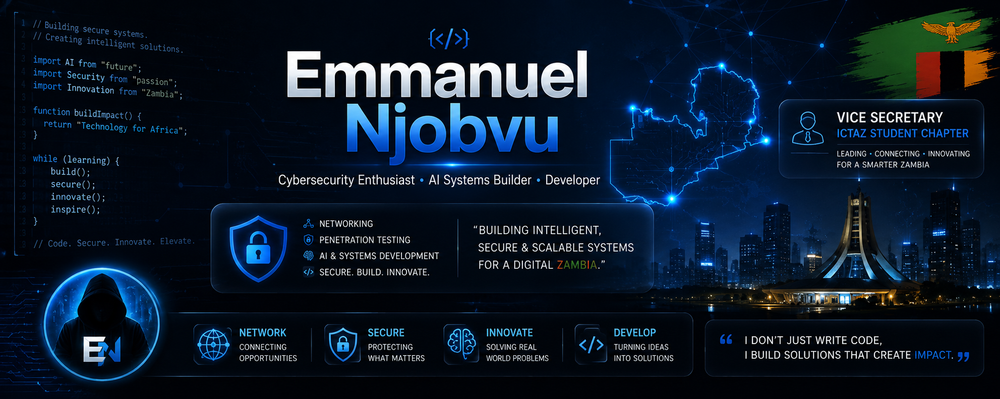

<p align="center">
  
</p>

<h1 align="center">Hi 👋, I'm Emmanuel Njobvu</h1>

<p align="center">
  
</p>

---

# 🛠 Tech Stack

<p align="center">


</p>

---
# 📊 GitHub Statistics

<p align="center">
  
</p>

<p align="center">
  
</p>

<p align="center">
  
</p>

---

# 📈 Contribution Activity

<p align="center">
  
</p>

---

# 🎯 Vision

> To engineer secure, intelligent, and scalable African technology systems that solve real-world problems and create sustainable impact.

---

# 🌐 Connect With Me

<p align="center">

<a href="https://github.com/Emmanuel-NJ">
  
</a>

<a href="https://www.linkedin.com/in/emmanuel-w-njobvu">
  
</a>

</p>

---

# ⚡ Development Philosophy

```text
Build systems that are secure.
Build systems that scale.
Build systems that solve real problems.
```

---

<p align="center">
  
</p>

<p align="center">
  ⚡ Building technology that matters.
</p>
